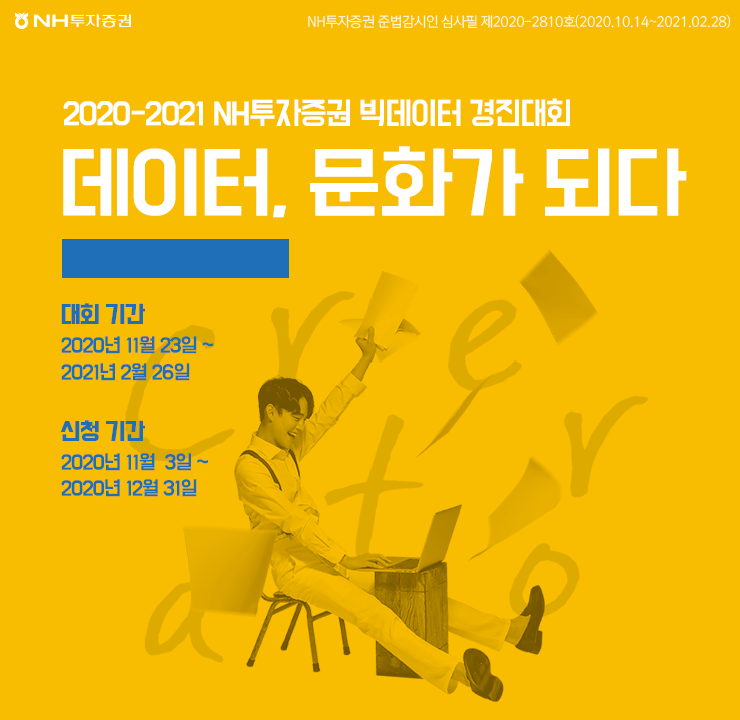

# 데이터, 문화가 되다:League1 "AI야, 진짜 뉴스를 찾아줘!"

- [대회 바로가기](https://www.dacon.io/competitions/official/235658/overview/description/)

NH투자증권 AI 경진대회 대회 제작 경과

   

## 대회 소개 (Introduction)

- '사실 정보'와 '광고'가 혼재된 온/오프라인 뉴스 기사의 지속적으로 증가하는 정보의 홍수 속에서, 고객에게 '진짜 정보'를 제공할 필요성 증대
- AI뉴스 필터링 알고리즘 개발을 통해, 고객이 필요로 하는 '진짜 뉴스'만 제공할 수 있는 기반 마련
- 뉴스 본문에서 가짜 정보를 제거하고 진짜 뉴스만 찾는 알고리즘 개발

## 주최/주관

- 주최/주관: NH 투자증권
- 운영: 데이콘 

## 규칙

1. 심사 기준: 
- 정확도(70%) : ACCURACY
- 수행속도(30%) : End time(수행종료시각) - Start time(수행시작시각)

2. 외부 데이터 및 사전 학습 모델

* 외부 데이터 사용 前 토론 게시판에 문의 要

